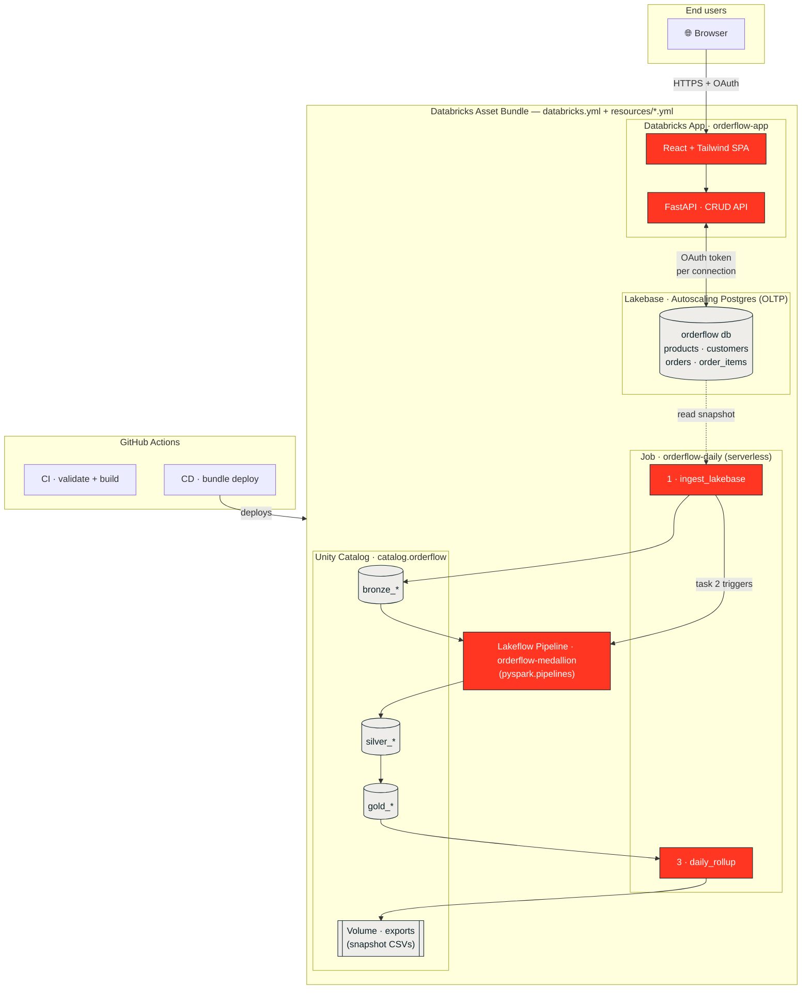

# OrderFlow architecture

This template demonstrates the canonical way to combine the Databricks developer stack
into one deployable application. Each piece is intentionally small so the wiring is easy
to read and adapt.

## The stack



**Legend:** red nodes are compute/code you own; sand nodes are managed data stores.
Solid arrows are the request/data path; the dashed arrow is the periodic Lakebase→lakehouse
snapshot. Everything inside the outer box is provisioned by one `databricks bundle deploy`.

## Data flow

1. **OLTP writes** — The Databricks App serves a CRUD API. Every create/update/delete
   hits Lakebase (`orderflow` Postgres database) directly. This is the system of record
   for live operational data.

2. **Ingest to the lakehouse** — The `orderflow-daily` job's first task
   (`jobs/ingest_lakebase.py`) reads each Lakebase table over a short-lived OAuth
   connection and lands a raw Delta copy as `<catalog>.<schema>.bronze_<table>`.

3. **Medallion transform** — The `orderflow-medallion` Lakeflow pipeline
   (`pipeline/transformations.py`) reads the bronze tables and builds:
   - **silver** — typed, cleaned, joined (`silver_products`, `silver_order_items`)
   - **gold** — business aggregates (`gold_category_sales`, `gold_order_status_summary`,
     `gold_low_stock`)

4. **Daily rollup** — The job's final task (`jobs/daily_rollup.py`) appends a dated row to
   `gold_daily_snapshot` so the business can trend revenue / units / open orders over time.

## Why these choices

- **Lakebase Autoscaling tier** — scale-to-zero managed Postgres; ideal for an app whose
  traffic is bursty. Provisioned via `databricks postgres` (project → branch → endpoint).
- **App resource attachment** — attaching Lakebase as an app resource auto-injects
  connection env vars and grants the app's service principal DB access, so no secrets are
  stored anywhere.
- **Per-connection OAuth** — `OAuthConnection` in `app/server/db.py` mints a fresh token
  whenever the pool opens a connection; `max_lifetime=2700` recycles before the 1-hour
  token expiry. No background refresh thread required.
- **Serverless everything** — pipeline and job run on serverless compute; the app is
  serverless-hosted. Nothing to size or keep warm.
- **One bundle** — `databricks.yml` + `resources/*.yml` deploy the Lakebase infra,
  app, pipeline, job, and volume together, so the whole system is versioned and
  reproducible. Even the database is infrastructure-as-code.

## Lakebase as native bundle resources

`resources/lakebase.yml` declares the full Lakebase hierarchy:

```
postgres_projects.orderflow_pg        (project_id: orderflow-db)
  └── postgres_branches.orderflow_production   (production, no_expiry: true)
        ├── postgres_endpoints.orderflow_primary  (ENDPOINT_TYPE_READ_WRITE)
        ├── postgres_roles.orderflow_owner        (USER, LAKEBASE_OAUTH_V1)
        └── postgres_databases.orderflow_db       (postgres_database: orderflow)
```

**Auto-created resources & binding.** Creating a `postgres_project` auto-provisions a
`production` branch, a `primary` endpoint, and a user role. Because the bundle also
declares these, a first deploy into a workspace where the project already exists will
report "already exists". Adopt them into bundle management once with:

```bash
databricks bundle deployment bind orderflow_production projects/orderflow-db/branches/production --auto-approve
databricks bundle deployment bind orderflow_primary    projects/orderflow-db/branches/production/endpoints/primary --auto-approve
databricks bundle deployment bind orderflow_owner      projects/orderflow-db/branches/production/roles/<user-role-id> --auto-approve
```

After binding, `bundle deploy` manages them normally. The `orderflow` database itself is
created fresh by the bundle (the auto-created default is `databricks-postgres`).

## Resource inventory

| Resource | Name | Notes |
|---|---|---|
| Lakebase project | `orderflow-db` | bundle-managed; production branch + `primary` endpoint |
| Lakebase database | `orderflow` | 4 tables (products, customers, orders, order_items) |
| UC schema | `<catalog>.orderflow` | holds bronze_/silver_/gold_ tables |
| UC volume | `<catalog>.orderflow.exports` | daily snapshot CSV exports |
| App | `orderflow-app` | React + FastAPI; Lakebase attached as `postgres` resource |
| Pipeline | `orderflow-medallion` | serverless, triggered, `pyspark.pipelines` |
| Job | `orderflow-daily` | 3 tasks, daily @ 06:00 (paused by default) |

## Adapting this template

- **New domain** — replace `scripts/schema.sql`, the Pydantic models + routes in
  `app/server/routes/`, and the pipeline transforms. The wiring stays the same.
- **New workspace** — edit `targets` hosts and the `variables` block in `databricks.yml`.
- **Real data** — point the ingest task at your own Lakebase instance, or swap in a
  Lakeflow Connect source upstream of bronze.
