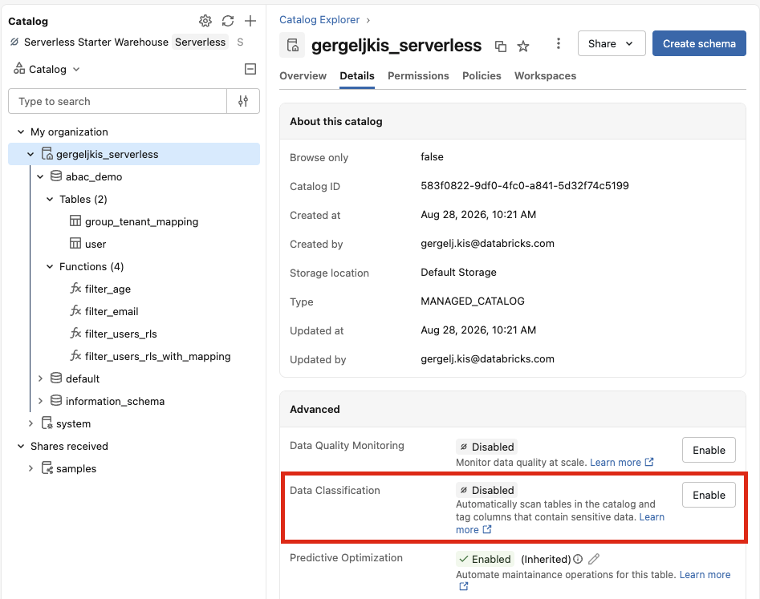
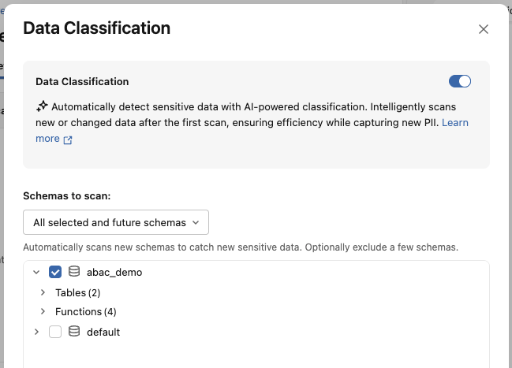
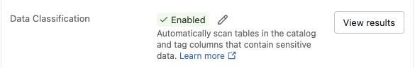
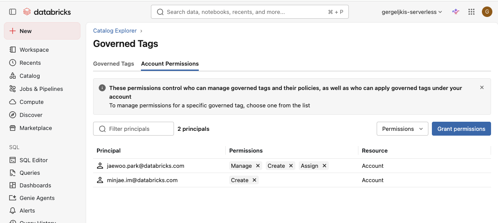
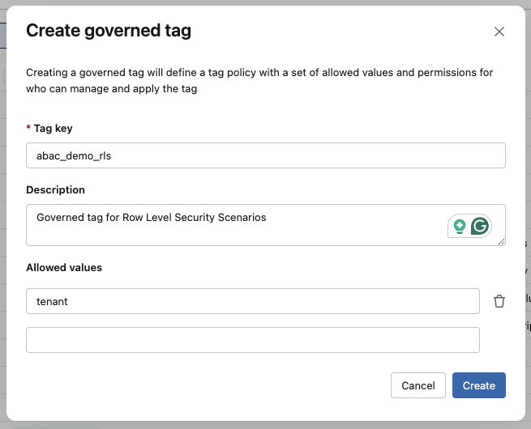

# ABAC Playbook: Data Classification & Policy Enforcement

This playbook walks through enabling **Databricks Data Classification** to automatically discover and tag sensitive data, then using **Attribute-Based Access Control (ABAC)** policies to enforce governance rules based on what the data actually contains.

> **Business scenario:** Your organization stores user data (names, emails, ages) across multiple tables. Rather than managing access table-by-table, you want the platform to *automatically* identify sensitive columns and enforce masking/filtering rules centrally - so that any new table containing PII is governed from the moment it is classified.

---

## Prerequisites

| Requirement | Details |
| --- | --- |
| Workspace | Unity Catalog enabled with serverless compute available |
| Runtime | Databricks Runtime 16.4+ (or serverless) for ABAC enforcement |
| Permissions | `MANAGE` or catalog owner to enable classification; account admin to manage governed tags |
| Demo tables | Run the **[setup.sql](demo/setup.sql)** script first to create the initial demo dataset |

---

## Step 1: Enable Data Classification on Your Catalog

Data Classification uses an agentic AI system to automatically scan tables in a catalog, detect sensitive data (PII, financial info, credentials), and apply **governed tags** to matching columns.

### How to enable (UI)

1. Open **Catalog Explorer** in the left navigation.
2. Select your catalog.
3. Click the **Details** tab.
4. Under **Data Classification** click **Enable**.
    - 
5. Select your preferred schemas for data classification and click 'Save'
    - 
6. The system begins scanning tables incrementally - no manual configuration needed.
<!-- 7. After a few moments a 'View Results' button will appear
    - 
8. The results are stored in a dedicated Data Classification page in the Governance Hub -->


### How it works

- The classification engine leverages an LLM-assisted agent to inspect column names, metadata, and sample values.
- Scanning is **incremental and optimized** - only new or changed data is re-scanned.
- Results are stored using default storage at no additional billing cost.
- Tags are applied as **system governed tags** (prefixed with `class.`).

### What gets tagged

After classification runs on the `user` table, expect the following automatic tags:

| Column | Expected Classification Tag | Description |
| --- | --- | --- |
| `user_name` | `class.name` | Name of a person |
| `email` | `class.email_address` | Email address |
| `age` | `class.age` | Age of an individual |

The `id` and `tenant_name` columns are not PII and should remain untagged.

---

## Step 2: Review Classification Results

Once classification completes, review what was detected.

### In the UI

1. Navigate to **Catalog Explorer** → your catalog → **Classification** tab.
2. You will see a summary of detected sensitive data categories.
3. Click **Review** on any classification tag to see:
   - Which columns were tagged
   - Sample values associated with detections
   - A **User Access** tab to create policies directly

### Via SQL

Query the `information_schema` to see all classification tags applied to your columns:

```sql
SELECT
  catalog_name,
  schema_name,
  table_name,
  column_name,
  tag_name,
  tag_value
FROM system.information_schema.column_tags
WHERE catalog_name = '<YOUR_CATALOG>'
  AND tag_name LIKE 'class.%'
ORDER BY table_name, column_name;
```

To verify the specific tags on the `user` table:

```sql
SELECT column_name, tag_name, tag_value
FROM system.information_schema.column_tags
WHERE catalog_name = '<YOUR_CATALOG>'
  AND schema_name = 'abac_demo'
  AND table_name = 'user';
```

---


## Step 3: Create a Governed Tag Manually (Optional)

Data Classification applies `class.*` governed tags automatically, but you can also create your own governed tags to enforce custom governance rules. A governed tag is an account-level tag with an associated **tag policy** that enforces allowed values and controls who can assign it - so any tag-driven ABAC policy applies consistently across the account.

> **When to use this:** When you want to govern data by a business attribute that automatic classification doesn't detect (e.g. `sensitivity_level`, `data_domain`, `retention_class`), or when you want to standardize a controlled vocabulary that analysts must apply.

### Permissions

To create a governed tag you need the `CREATE` permission at the account level. Account admins and workspace admins have it by default. You can control who has these permissions under the Governed Tags page in the Account Permissions tab (see image below).



### How to create (UI)

1. Click the **Catalog** icon in the left navigation.
2. Click the **Govern** button (shield icon).
3. Select **Governed Tags** from the menu.
4. Click **Create governed tag**.
5. Enter a **tag key**.
6. Optionally add a **description**.
7. Optionally define the **allowed values** to enforce a controlled vocabulary.
8. Click **Create**.



### Via SQL

```sql
CREATE GOVERNED TAG abac_demo_rls
  DESCRIPTION 'Governed tag for Row Level Security Scenarios'
  VALUES ('tenant');
```

**Notes:**
- You can create a maximum of **1,000 governed tags per account**.
- Tag keys and values cannot contain the characters `* . / < > % & ? \ =` or control characters, and cannot begin or end with whitespace.

---

## Step 4: Apply the Governed Tag

Creating a governed tag only defines the tag policy - it does not attach the tag to any data. In this step you **assign** the `abac_demo_rls` tag to the column you want ABAC policies to match on. You need the `ASSIGN` permission on the governed tag to do this.

> In the demo, we tag the `tenant_name` column with `abac_demo_rls = 'tenant'` so that a tag-driven row filter policy can match it, rather than referencing the column by name.

### How to apply (UI)

1. Click the **Catalog** icon in the left navigation and select your table (e.g. `<YOUR_CATALOG>.abac_demo.user`).
2. Open the **Overview** page and locate the **Columns** section (or select the table itself to tag it at the table level).
3. Next to the target column (`tenant_name`), click **Add tags** (or the edit/pencil icon if tags already exist).
4. Choose the governed tag key **`abac_demo_rls`** and select the allowed value **`tenant`**.
5. Click **Save**.

### Via SQL

Apply the governed tag to a **column**:

```sql
ALTER TABLE <YOUR_CATALOG>.abac_demo.user
ALTER COLUMN tenant_name
SET TAGS ('abac_demo_rls' = 'tenant');
```

**Notes:**
- To remove a tag, use `UNSET TAGS ('abac_demo_rls')` in place of `SET TAGS`.

### Verify the tag was applied

```sql
SELECT column_name, tag_name, tag_value
FROM system.information_schema.column_tags
WHERE catalog_name = '<YOUR_CATALOG>'
  AND schema_name = 'abac_demo'
  AND table_name = 'user'
  AND tag_name = 'abac_demo_rls';
```

---

## Step 5: Define the Business Purpose

Before creating policies, define **what governance rules the classified data requires**. This is the bridge between "what data exists" and "how it should be treated."

### Example business rules

| Classification Tag | Business Rule | Implementation |
| --- | --- | --- |
| `class.email_address` | Email addresses must be masked for all users except data admins | Column mask → return `'***@***'` |
| `class.age` | Age must be hidden for all users except HR | Column mask → return `0` |
| `class.name` | Names are visible and don't require any policy to hide them | None |
| `abac_demo_rls.tenant` | Return only specific tenants in the queries | Row Level Security on the tenant name |

These rules map directly to the masking and filter functions already created by the [`demo/setup.sql`](demo/setup.sql) script:

- `filter_email(email STRING) → '***@***'`
- `filter_age(age INT) → 0`
- `filter_users_rls(tenant STRING) → BOOLEAN` (row filter — returns `TRUE` only for `abac_demo_group_1` members on `tenantB` rows)

---

## Step 6: Create ABAC Policies Based on Classification Tags

ABAC policies let you define governance rules **once** and have them apply dynamically to any table matching the tag condition. When new tables are classified with the same tags, they are automatically governed.

### 6a. Column Mask Policy - Mask Emails

This policy masks any column tagged `class.email_address` across all tables in the schema.

```sql
CREATE OR REPLACE POLICY mask_classified_emails
ON SCHEMA <YOUR_CATALOG>.abac_demo
COMMENT 'Mask email columns detected by Data Classification'
COLUMN MASK <YOUR_CATALOG>.abac_demo.filter_email
TO `account users`
-- EXCEPT  `Governance_Admins`
FOR TABLES
MATCH COLUMNS has_tag('class.email_address') AS email_col
ON COLUMN email_col;
```

**What this does:**
- Scoped to the `abac_demo` schema
- Applies to **all account users**
- Matches any column that Data Classification tagged with `class.email_address`
- Calls `filter_email()` on the matched column, returning `'***@***'`

### 6b. Column Mask Policy — Mask Ages

```sql
CREATE OR REPLACE POLICY mask_classified_ages
ON SCHEMA <YOUR_CATALOG>.abac_demo
COMMENT 'Mask age columns detected by Data Classification'
COLUMN MASK <YOUR_CATALOG>.abac_demo.filter_age
TO `account users`
-- EXCEPT  `Governance_Admins`
FOR TABLES
MATCH COLUMNS has_tag('class.age') AS age_col
ON COLUMN age_col;
```

### 6c. Row Filter Policy — Tenant-Based Access

This policy restricts row visibility based on the user's group membership and tenant mapping.

```sql
CREATE OR REPLACE POLICY tenant_row_isolation
ON SCHEMA <YOUR_CATALOG>.abac_demo
COMMENT 'Restrict rows by tenant membership using group mapping table'
ROW FILTER <YOUR_CATALOG>.abac_demo.filter_users_rls
TO `account users`
-- EXCEPT  `Governance_Admins`
FOR TABLES
MATCH COLUMNS has_tag_value('abac_demo_rls','tenant') AS tenant_col
USING COLUMNS (tenant_col);
```

**What this does:**
- Scoped to the `abac_demo` schema
- Calls `filter_users_rls(tenant_name)` for each row
- Returns only rows where the user's group maps to the row's tenant (defined in the function `filter_users_rls`)
- Members of `abac_demo_group_1` see only `tenantB` rows; others see nothing

> Note: To see actual `tenantB` data, you need to be a member of an account group `abac_demo_group_1` that has access to the workspace and the `abac_demo` schema.

### Optional: exempt an admin group from the policies

Each policy above has a commented-out `EXCEPT ``Governance_Admins``` clause. This is **opt-in and not enabled by default** — the `Governance_Admins` group is not created anywhere in this playbook. To let a group of admins bypass masking and row filtering:

1. Create the group and add the intended members, e.g. via **Catalog** → **Govern**, the account console, or SQL/Terraform. Substitute your own group name if you don't want to use `Governance_Admins`.
2. Uncomment the `EXCEPT` line (and remove the leading `--`) in each of the three policies above, matching the group name you created.
3. Re-run the `CREATE OR REPLACE POLICY` statements so the exemption takes effect.

Without these steps, all `account users` — admins included — are subject to the policies.

---

## Step 7: Verify Policy Enforcement

### Check which policies are active

```sql
USE CATALOG <YOUR_CATALOG>;

-- Show policies defined on the schema
SHOW POLICIES ON SCHEMA abac_demo;

-- Show all effective policies on the user table (including inherited)
SHOW EFFECTIVE POLICIES ON TABLE abac_demo.user;

-- Describe a specific policy
DESCRIBE POLICY mask_classified_emails ON SCHEMA abac_demo;
```

### Test as a governed user

Query the table to see enforcement in action:

```sql
SELECT * FROM <YOUR_CATALOG>.abac_demo.user;
```

> **Expect zero rows on your first run — this is the RLS policy working, not a broken demo.** `filter_users_rls` returns rows only to members of `abac_demo_group_1` (and only `tenantB` rows). Anyone else — including whoever just set up the demo — sees an empty table. To see the `tenantB` rows below, make sure you are a member of `abac_demo_group_1`; note that account group membership can take a few minutes to propagate before rows appear.

**Expected results for a member of `abac_demo_group_1`:**

| id | user_name | email | age | tenant_name |
| --- | --- | --- | --- | --- |
| 2 | Bob | \*\*\*@\*\*\* | 0 | tenantB |
| 5 | Edward | \*\*\*@\*\*\* | 0 | tenantB |
| 8 | Hannah | \*\*\*@\*\*\* | 0 | tenantB |

- **Row filter**: Only `tenantB` rows are visible (3 of 10 rows)
- **Email mask**: All email values show `***@***`
- **Age mask**: All age values show `0`
- **Name**: Visible (no mask policy on `class.name`)

**Expected results for an exempt admin** — *only if you completed the optional exemption step in Step 6* (created a `Governance_Admins` group and uncommented the `EXCEPT` clause in each policy):

A member of that group sees all 10 rows with full, unmasked data. If you did not enable the exemption, admins are governed just like any other `account users` member and see the masked, row-filtered result above.

---

## Step 8: The Power of Auto-Governance

The key advantage of combining Data Classification with ABAC policies is **automatic governance of new data**.

### Scenario: A new table is added

```sql
CREATE TABLE <YOUR_CATALOG>.abac_demo.customers_new (
  id INT,
  full_name STRING,
  contact_email STRING,
  customer_age INT
);
```

When Data Classification scans this table:
1. `contact_email` gets tagged `class.email_address` → **automatically masked** by `mask_classified_emails`
2. `customer_age` gets tagged `class.age` → **automatically masked** by `mask_classified_ages`
3. No manual `ALTER TABLE ... SET MASK` required

This is the difference between **manual** column masks (per-table) and **ABAC policies** (tag-driven, schema- or catalog-wide).

---

## Cleanup

To remove the policies and demo objects:

```sql
USE CATALOG <YOUR_CATALOG>;

-- Drop the schema
DROP SCHEMA IF EXISTS abac_demo CASCADE;

-- Drop the manually created tag
DROP GOVERNED TAG abac_demo_rls;
```

---

## Quick Reference

| Concept | Description |
| --- | --- |
| **Data Classification** | Agentic AI that scans catalogs and applies `class.*` governed tags to sensitive columns |
| **Governed Tags** | Account-level tags with enforced allowed values (e.g. `class.email_address`, `class.age`) |
| **ABAC Policy** | A rule that dynamically applies row filters or column masks based on tag conditions |
| **`MATCH COLUMNS has_tag(...)`** | Identifies columns to mask by their governed tag, not by column name (see Steps 6a/6b) |
| **`MATCH COLUMNS has_tag_value(...)`** | Matches columns whose tag has a specific value — e.g. the RLS policy in Step 6c uses `has_tag_value('abac_demo_rls','tenant')` |
| **Policy inheritance** | Catalog-level policies inherit to all schemas/tables; schema-level to all tables |

---

## Further Reading

- [Data Classification documentation](https://docs.databricks.com/data-governance/unity-catalog/data-classification/)
- [Supported classification tags](https://docs.databricks.com/data-governance/unity-catalog/data-classification-tags/)
- [ABAC policies in Unity Catalog](https://docs.databricks.com/data-governance/unity-catalog/abac/)
- [Governed tags](https://docs.databricks.com/data-governance/unity-catalog/tags)