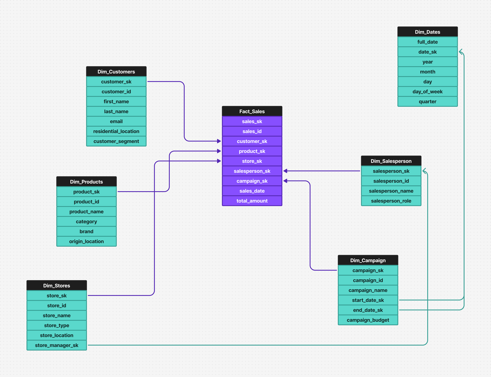

# UC Business Semantics - Retail Store Dimensional Model



This demo shows how to use [UC Business Semantics](https://docs.databricks.com/aws/en/metric-views/) in Databricks to define, manage, and govern business KPIs directly on the platform. UC Business Semantics provides a unified, open semantic foundation that makes core business concepts accessible for both human-driven analytics (BI) and AI/ML workloads.

The demo creates **metric views** — centrally defined, governed SQL objects in Unity Catalog — that encode joins, dimensions, measures, and rich semantic metadata (display names, synonyms, formatting rules). These metric views can then be queried from any BI tool, SQL client, or AI agent (like Genie).

## Dataset

This demo uses the [Retail Store Star Schema Dataset](https://www.kaggle.com/datasets/shrinivasv/retail-store-star-schema-dataset) from Kaggle. The dataset contains a star schema with a `fact_sales_normalized` fact table and the following dimension tables:

- `dim_campaigns` - Marketing campaigns with budget and date ranges
- `dim_customers` - Customer demographics and segmentation
- `dim_dates` - Date dimension for time-based analysis
- `dim_products` - Product catalog with categories and brands
- `dim_salespersons` - Sales team roles and details
- `dim_stores` - Store locations and types

## Prerequisites

Before running the notebooks, ensure you have:

1. **Unity Catalog enabled workspace** with permissions to create catalogs, schemas, and volumes.
2. **Serverless compute** enabled on your workspace (materialized metric views require serverless).
3. **A SQL Warehouse** - needed for the Genie Space and Dashboard creation in notebook 2. To find your warehouse ID:
   - Navigate to **SQL Warehouses** in the Databricks sidebar
   - Click on your warehouse
   - The warehouse ID is in the URL: `https://<workspace>/sql/warehouses/<warehouse_id>`
4. **Kaggle access** - the dataset is downloaded via `kagglehub` (no API key required for public datasets).

## What Gets Created

| Resource | Name | Description |
|----------|------|-------------|
| Catalog | `<CATALOG_NAME>` | Unity Catalog catalog for all objects |
| Schema | `<CATALOG_NAME>.<SCHEMA_NAME>` | Schema containing tables and views |
| Volume | `<CATALOG_NAME>.<SCHEMA_NAME>.kaggle_files` | Volume for staging Kaggle CSV files |
| Tables | 7 Delta tables | Fact and dimension tables from the dataset |
| Metric View | `sales_relationships` | Metric view with joins, dimensions, measures, and window measures |
| Materialized Metric View | `materialized_sales_relationships` | Same metric view with materialization for improved query performance |
| Genie Space | `Sample Sales Genie Space` | AI-powered natural language query interface |
| Dashboard | `dashboard_parameterized.lvdash.json` | AI/BI dashboard consuming the metric view |

## Notebooks

Run the notebooks in order:

### [`0_IngestData.ipynb`](./0_IngestData.ipynb)
Downloads the Kaggle dataset into a UC Volume and loads each CSV file as a Delta table. Creates the catalog, schema, and volume if they don't exist.

**Parameters:** `CATALOG_NAME`, `SCHEMA_NAME`, `VOLUME_PATH`

### [`1_CreateMetricView.ipynb`](./1_CreateMetricView.ipynb)
Creates the `sales_relationships` metric view as part of UC Business Semantics. The YAML definition includes:
- Star and snowflake joins across all dimension tables
- Dimensions with semantic metadata (display names, synonyms, comments)
- Aggregate measures (sum, avg, stddev, percentiles, min, max, mode)
- Window measures (day-over-day growth, running totals, YTD, trailing 7d/30d customers)

**Parameters:** `CATALOG_NAME`, `SCHEMA_NAME`

### [`2_QueryMetricView.ipynb`](./2_QueryMetricView.ipynb)
Demonstrates querying the metric view using `MEASURE()` syntax, and optionally creates a Genie Space and a parameterized AI/BI Dashboard from serialized templates.

**Parameters:** `CATALOG_NAME`, `SCHEMA_NAME`, `warehouse_id`

### [`3_MaterializeMetricView.ipynb`](./3_MaterializeMetricView.ipynb)
Creates a materialized version of the metric view with scheduled refreshes. Compares query performance between the non-materialized and materialized versions, and shows how to verify materialization usage via `EXPLAIN EXTENDED`.

**Parameters:** `CATALOG_NAME`, `SCHEMA_NAME`

## Directory Structure

```
dbrx-business-semantics/
├── 0_IngestData.ipynb                  # Data ingestion from Kaggle
├── 1_CreateMetricView.ipynb            # Metric view creation (UC Business Semantics)
├── 2_QueryMetricView.ipynb             # Querying, Genie Space, and Dashboard
├── 3_MaterializeMetricView.ipynb       # Materialized metric view
├── README.md
├── dashboard_and_genie/
│   ├── dashboard.lvdash.json           # Template dashboard definition
│   ├── dashboard_parameterized.lvdash.json  # Parameterized dashboard (generated)
│   └── genie_space.json                # Serialized Genie Space definition
└── figures/
    ├── dimensional_model.png           # Star schema ERD
    ├── materialized_metric_view_ui.png # UC UI showing materialization status
    ├── metric_view_in_dashboards.png   # Dashboard screenshot
    └── metric_view_in_genie.png        # Genie Space screenshot
```

## What is UC Business Semantics?

UC Business Semantics provides a unified, open semantic foundation for enterprises. It consists of two parts:

- **Metric Views**: Centrally define and govern business KPIs (e.g., revenue, churn, ARR) as reusable SQL objects, fully governed in Unity Catalog.
- **Agent Metadata**: Rich semantic metadata (synonyms, formatting rules, display names) that makes AI agents more accurate and reliable.

Unlike BI-native semantic layers that trap definitions inside a single tool, UC Business Semantics is **open and reusable** across different BI tools, SQL clients, and AI agents. It is **AI-ready** — extending seamlessly to workloads like Genie — and **unified and governed**, inheriting Unity Catalog policies automatically.

## Resources

- [Docs - UC Business Semantics (Metric Views)](https://docs.databricks.com/aws/en/metric-views/)
- [Docs - Metric view joins](https://docs.databricks.com/aws/en/metric-views/data-modeling/joins)
- [Docs - Semantic metadata](https://docs.databricks.com/aws/en/metric-views/data-modeling/semantic-metadata)
- [Docs - Window measures](https://docs.databricks.com/aws/en/metric-views/data-modeling/window-measures)
- [Docs - Materialization](https://docs.databricks.com/aws/en/metric-views/materialization)
- [Video - Unity Catalog Metric Views Overview](https://www.databricks.com/resources/demos/videos/unity-catalog-metric-views-overview)
- [Video - Understanding Your Business With Unity Catalog Metric Views](https://www.databricks.com/resources/demos/videos/understanding-your-business-with-unity-catalog-metric-view)
