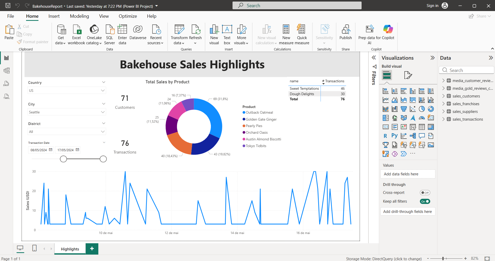
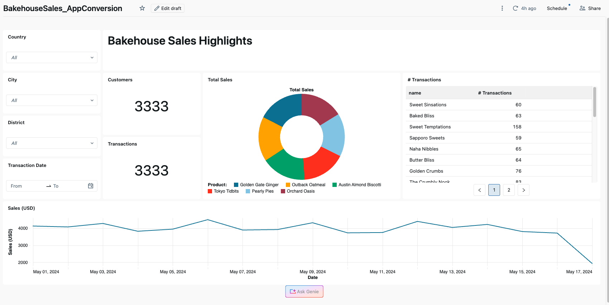
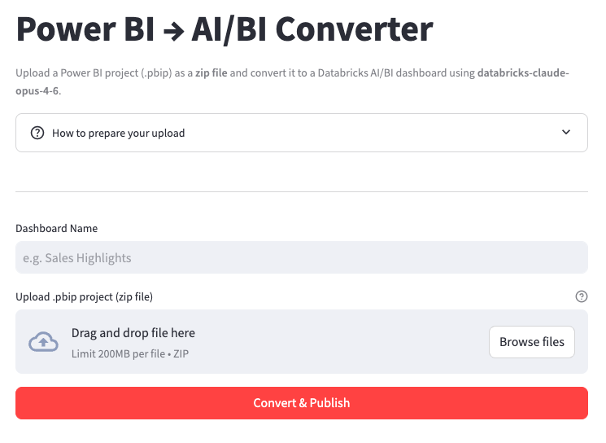

# Power BI to Databricks AI/BI Dashboard Converter

Convert Power BI reports (.pbip) into Databricks AI/BI dashboards (.lvdash.json) using a self-service Streamlit app deployed on Databricks Apps.

---

## Before & After

**Power BI Desktop**



**Databricks AI/BI Dashboard**



---

## How It Works



The `app_for_conversions/` folder contains a ready-to-deploy Streamlit app that runs on Databricks Apps. Users upload a zipped `.pbip` project, and the app uses an LLM to convert it into a published AI/BI dashboard — no IDE or coding required.

### Architecture

```
┌──────────────────────┐       ┌──────────────────────────┐       ┌──────────────────────┐
│  User's Browser      │       │  Databricks App          │       │  Databricks Workspace│
│                      │       │  (Streamlit)│            │       │                      │
│  Upload .pbip zip ───┼──────>│                          │       │                      │
│  Enter report name   │       │  1. Extract zip          │       │                      │
│  Click "Convert"     │       │  2. Parse PBI structure  │       │                      │
│                      │       │  3. Send to LLM endpoint │──────>│  Model Serving       │
│                      │       │  4. Parse JSON response  │       │  (Claude Opus 4.6)   │
│  ← Open Dashboard ───┼──────<│  5. Create dashboard     │──────>│  Lakeview API        │
│                      │       │  6. Publish dashboard    │──────>│  SQL Warehouse       │
└──────────────────────┘       └──────────────────────────┘       └──────────────────────┘
```

---

## Prerequisites

- A Databricks workspace with:
  - A **SQL warehouse** (the warehouse ID is configured in `app.yaml`)
  - A **Model Serving endpoint** for the LLM (default: `databricks-claude-opus-4-6`)
  - **Databricks Apps** enabled

---

## Deploy the App

### 1. Configure `app.yaml`

Update the warehouse ID and LLM model to match your workspace:

```yaml
command: ["streamlit", "run", "app.py"]

env:
  - name: DATABRICKS_WAREHOUSE_ID
    value: "<your-warehouse-id>"
  - name: LLM_MODEL
    value: "databricks-claude-opus-4-6"
```

To find your warehouse ID, run:
```bash
databricks warehouses list --output json | jq '.[].id'
```

### 2. Grant the app's service principal access to the SQL warehouse

When you create a Databricks App, a service principal is automatically provisioned for it. This service principal needs **CAN USE** permission on the SQL warehouse configured in `app.yaml`, because the app uses the service principal's credentials (not the user's token) to create dashboards, publish them, validate SQL queries, and create workspace folders.

To grant access:
1. Go to **SQL Warehouses** in the Databricks UI
2. Click on your warehouse > **Permissions**
3. Add the app's service principal (named after your app, e.g., `pbi-converter`) with **Can use** permission

Without this, the app will fail with permission errors when trying to deploy or validate dashboards.

### 3. Upload and deploy

```bash
# Upload app files to your workspace
databricks workspace import-dir \
  app_for_conversions \
  /Workspace/Users/<your-email>/apps/pbi-converter \
  --overwrite

# Create the app (first time only)
databricks apps create pbi-converter \
  --description "Power BI to AI/BI Converter"

# Deploy
databricks apps deploy pbi-converter \
  --source-code-path /Workspace/Users/<your-email>/apps/pbi-converter
```

### 4. Open the app

Navigate to the URL shown in the deploy output (e.g., `https://pbi-converter-<workspace>.azure.databricksapps.com`).

---

## Using the App

1. **Export from Power BI Desktop**: File > Save As > Power BI project files (*.pbip)
2. **Zip the results**: Select the `.pbip` file, `.Report/` folder, and `.SemanticModel/` folder, then compress them into a single `.zip` file
3. **Upload**: Open the app, enter a dashboard name, upload the zip, and click **Convert & Publish**
4. **View**: Click the **Open Dashboard** link to see your new AI/BI dashboard

---

## Sample Reports

The `sample_reports_for_conversion/` folder contains pre-packaged `.zip` files you can upload directly to the app for testing:

| File | Description |
|------|-------------|
| `Simple_BakehouseReport.zip` | A simple single-page Bakehouse franchise sales report (cards, charts, slicers) using `samples.bakehouse` tables |
| `Wanderbricks report.zip` | A more complex multi-page report for testing richer conversion scenarios |

These are ready to use — just upload one to the app and click **Convert & Publish**.

---

## Project Structure

```
app_for_conversions/
├── app.py              # Streamlit app: UI + conversion orchestration
├── app.yaml            # Databricks Apps config (command, env vars)
├── clients.py          # WorkspaceClient / OpenAI client setup
├── converter.py        # PBI extraction, LLM conversion, layout helpers
├── validator.py        # .lvdash.json and SQL validation
├── export_pdf.py       # PDF export helper
├── requirements.txt    # Python dependencies (databricks-sdk, openai)
├── .streamlit/
│   └── config.toml
├── knowledge/          # Reference docs loaded into the LLM system prompt
│   ├── CONVERSION_GUIDE.md
│   ├── AIBI_DASHBOARD_SKILL.md
│   └── DAX_TO_SQL_GUIDE.md
└── static/
    └── power_bi_save_as_pbip.png
```

---

## Conversion Reference

### Visual Type Mapping

| Power BI Visual | AI/BI Widget | Version |
|-----------------|-------------|---------|
| `textbox` | Text (multilineTextboxSpec) | N/A |
| `card` | `counter` | 2 |
| `slicer` (dropdown) | `filter-multi-select` | 2 |
| `slicer` (date range) | `filter-date-range-picker` | 2 |
| `lineChart` | `line` | 3 |
| `barChart` | `bar` | 3 |
| `donutChart` / `pieChart` | `pie` | 3 |
| `pivotTable` / `table` | `table` | 2 |
| `shape` | (skip — decorative) | - |

### Aggregation Mapping

| PBI DAX Function | SQL Equivalent |
|------------------|---------------|
| SUM(column) | `SUM(\`column\`)` |
| AVERAGE(column) | `AVG(\`column\`)` |
| COUNT(column) | `COUNT(\`column\`)` |
| DISTINCTCOUNT(column) | `COUNT(DISTINCT \`column\`)` |
| MIN(column) / MAX(column) | `MIN(\`column\`)` / `MAX(\`column\`)` |

### Key Differences

| Concept | Power BI | Databricks AI/BI |
|---------|----------|------------------|
| Data model | Star schema with relationships | Flat SQL datasets with JOINs |
| Measures | DAX expressions | SQL aggregations in widget fields |
| Filters | Slicers on canvas | Filter widgets on global or page-level filter pages |
| Layout | Pixel coordinates (1280x720) | 6-column grid system |
| Deployment | Publish to Power BI Service | Deploy `.lvdash.json` to workspace |

---

## Tips for Complex Dashboards

- **Multi-page reports**: Each PBI page becomes a separate `PAGE_TYPE_CANVAS` page. Pages are listed in `pages/pages.json`.
- **DAX calculated columns**: Move the logic into the SQL dataset query using CASE/WHEN, COALESCE, or other Spark SQL functions.
- **Cross-filtering**: AI/BI filters work through shared dataset columns. Include filter dimensions in every dataset that should respond to that filter.
- **High cardinality dimensions**: If a PBI visual groups by a column with many distinct values (>10), use a table widget instead of a chart, or add a TOP-N filter in the SQL query.
- **Maps / geo visuals**: AI/BI dashboards don't support map widgets. Convert these to tables or bar charts grouped by location.
- **Custom visuals**: No equivalent for PBI custom visuals. Identify the closest standard widget type or represent the data differently.

---

## Relevant Documentation

- [Power BI Projects (.pbip) Overview](https://learn.microsoft.com/en-us/power-bi/developer/projects/projects-overview)
- [How Hard Is It to Migrate a Power BI Dashboard?](https://blog.cauchy.io/p/how-hard-is-it-to-migrate-a-power?r=6r7jvu)
- [Databricks AI Dev Kit](https://github.com/databricks-solutions/ai-dev-kit/tree/main)
- [Databricks AI/BI Dashboards](https://docs.databricks.com/en/dashboards/index.html)
- [Databricks Asset Bundles](https://docs.databricks.com/en/dev-tools/bundles/index.html)

---

## License

This project is provided as-is for educational and demonstration purposes.
